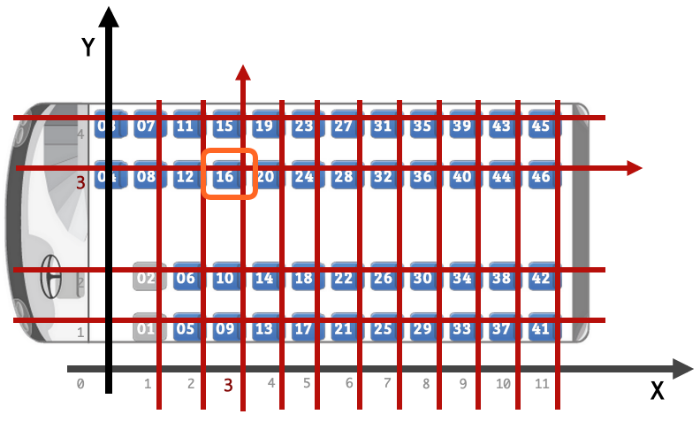

FORMAT: 1A

# Clickbus Public API

This is the documentation and samples for Clickbus Public API Also this can be used as mocked data to simply test API integration.

In this documentation you may find both how to integrate with Clickbus API for any country avaliable in Clickbus Portifolio but also use as a guideline to create your own Booking engine and submit to us to quickly implement your services and start selling your bus services as well using clickbus (contato@clickubs.com.br for more commercial details).

### **Overview**

Below are the topic Groups to perform every task for your applications:

- **Search** for any routes and travels;
- Obtain **Trip Details** from each route;
- **Seat Block** to lock or unlock seat reservations;
- **Booking** orders;
- Sign your actions with an ID provided by **Session**.

# API Reference

## **Predicates**

1. All sucessfull requests return a **20*** Response header;
2. All requests that may lack a given parameter, which is required, will return a **400** Response header, along with a body message as below:
    ```json
    {
        "message":"Invalid Parameters"
    }
    ```
3. The **Evaluation** environment (http://api-evaluation.clickbus.com.br/api/v1) have only 1 possible trip: from **Sao Paulo, Tiete** (`sao-paulo-tiete-sp`) to **Santos, SP** (`santos-sp`), and vice-versa.

## **Groups**

# Group Search

## Get Avaliable Trips [/search]

The resource `/search` provides a list with all available trips, with all sort of details you may need.

**ADVICES:** 

1. Remember that each request to `/search` will erase all itens stored in your Pre-Order, so, if you don't have confirmed your Order yet, all the items added to the Pre-Order will be lost.
2. The params **store**, **model** and **platform** are required and created for each partner. To obtain these credentials, please contact our commercial department at contato@clickbus.com.br.

### Get Avaliable Trips [GET]

**Parameters**

|PARAMS|VALUE|DESCRIPTION|EXAMPLE|
|:----|:----|:----|:---:|
|**from** (required)|_string_|A destination from where a trip starts.|`sao-paulo-jabaquara-sp`|
|**to** (required)|_string_|A destination to where a trip ends.|`santos-sp`|
|**departure** (required)|_date_|Any valid date, in format `yyyy-mm-dd`.|`2015-02-11`|
|**store** (required)|_string_|A specific param for each partner. Please contact ClickBus at contato@clickubs.com.br for more commercial details.|`clickbus`|
|**model** (required)|_string_|A specific param for each partner. Please contact ClickBus at contato@clickubs.com.br for more commercial details.|`retail`|
|**platform** (required)|_string_|A specific param for each partner. Please contact ClickBus at contato@clickubs.com.br for more commercial details.|`web`|
|**engine** (optional)|_string_|Specify in what booking engine you want to perform the search; if not provided, the search will be executed in the availiable booking engine on the server.|`5411E7D726991`|
|**quantity** (optional)|_int_|The minimum ammount of avaliable seats.|`10`|
|**locale** (optional)|_string_|The locale you want to perform the search. If you provide no value for this param, the system will try to search in all languages avaliables on the server (which can take more time to return the results).|`pt_BR`|

**Response**

With the correct params, this resource returns a Response _200_ and a list, in JSON format, with these details as follow:

- `paymentSettings`, like:
    - `creditcard`, with it's own `serviceFee` and `serviceFeePercentage` which is attributed for each partner (contact ClickBus at contato@clickubs.com.br for more commercial details);
    - `debitcard`, `paypal_hpp` and `banktransfer` information;
- `items`, which have:
    - `from` and `to` destinations;
    - `parts` section, which contains:
        - `waypoint` information, such as `schedule` for each waypoint, including `price`, `date` and `time`;
        - Which `busCompany` offer these travels;
        - `availableSeats` provides how many seats are available.

**WARNING:** The data returned on `paymentSettings` is deprecated since 19th January, 2015.

**Examples**

 - Searching for travels from _Sao Paulo - Brazil_ to _Santos - Brazil_ in _11th Feb 2015_, with all correct params:

    - URL:
        ```
        api/v1/search?from=sao-paulo-jabaquara-sp&to=santos-sp&departure=2015-02-11&store=clickbus&platform=web&model=retail
        ```
    - Response:
        ```json
        {
            "meta": "",
            "paymentSettings": {
                "bankslip": {
                    "total": "0.00",
                    "discount_id": 0,
                    "discount_type": 0,
                    "discount_value": 0,
                    "savings": 0,
                    "fixedValue": 0,
                    "serviceFee": 0,
                    "serviceFeePercentage": 0
                },
                "creditcard": {
                    "total": {
                        "1": "0.00",
                        "2": "0.00",
                        "3": "0.00",
                        "4": "0.00",
                        "5": "0.00",
                        "6": "0.00",
                        "7": "0.00",
                        "8": "0.00",
                        "9": "0.00",
                        "10": "0.00",
                        "11": "0.00",
                        "12": "0.00"
                    },
                    "discount_id": 0,
                    "discount_type": 0,
                    "discount_value": 0,
                    "savings": 0,
                    "fixedValue": 0,
                    "serviceFee": {
                        "1": 0,
                        "2": 0,
                        "3": 0,
                        "4": 0,
                        "5": 0,
                        "6": 0,
                        "7": 0,
                        "8": 0,
                        "9": 0,
                        "10": 0,
                        "11": 0,
                        "12": 0
                    },
                    "serviceFeePercentage": {
                        "1": "0.00",
                        "2": "0.00",
                        "3": "0.00",
                        "4": "0.00",
                        "5": "0.00",
                        "6": "0.00",
                        "7": "0.00",
                        "8": "0.00",
                        "9": "0.00",
                        "10": "0.00",
                        "11": "0.00",
                        "12": "0.00"
                    }
                },
                "debitcard": {
                    "total": "0.00",
                    "discount_id": 0,
                    "discount_type": 0,
                    "discount_value": 0,
                    "savings": 0,
                    "fixedValue": 0,
                    "serviceFee": 0,
                    "serviceFeePercentage": 0
                },
                "paypal_hpp": {
                    "total": "0.00",
                    "discount_id": 0,
                    "discount_type": 0,
                    "discount_value": 0,
                    "savings": 0,
                    "fixedValue": 0,
                    "serviceFee": 0,
                    "serviceFeePercentage": 0
                },
                "banktransfer": {
                    "total": "0.00",
                    "discount_id": 0,
                    "discount_type": 0,
                    "discount_value": 0,
                    "savings": 0,
                    "fixedValue": 0,
                    "serviceFee": 0,
                    "serviceFeePercentage": "13.00"
                }
            },
            "items": [{
                "from": "Sao Paulo, SP - Jabaquara",
                "to": "Santos, SP",
                "parts": [{
                    "trip_id": "2949",
                    "departure": {
                        "price": "2191",
                        "waypoint": {
                            "id": "4016",
                            "prices": [{
                                "waypoint": "3935",
                                "price": "2191"
                            }],
                            "schedule": {
                                "id": "NDAxNi0tMzkzNS0tMjAxNS0wMi0xMSAwMTowMC0tNy0tMjk0OS0tMS0tMS0tMS0tQ09OVg==",
                                "date": "2015-02-11",
                                "time": "01:00",
                                "timezone": "America/Sao_Paulo"
                            },
                            "context": "departure",
                            "place": {
                                "country": "BRA",
                                "state": "",
                                "city": "Sao Paulo, SP - Jabaquara",
                                "station": {
                                    "current": {
                                        "id": "4016",
                                        "name": "Sao Paulo, SP - Jabaquara",
                                        "locale": "en_US"
                                    },
                                    "default": {
                                        "id": "",
                                        "name": "",
                                        "locale": ""
                                    }
                                },
                                "locale": "pt_BR",
                                "id": "4016"
                            },
                            "isDeparture": "true",
                            "position": "0"
                        }
                    },
                    "arrival": {
                        "price": "2191",
                        "waypoint": {
                            "id": "3935",
                            "prices": [{
                                "waypoint": "",
                                "price": ""
                            }],
                            "schedule": {
                                "id": "NDAxNi0tMzkzNS0tMjAxNS0wMi0xMSAwMTowMC0tNy0tMjk0OS0tMS0tMS0tMS0tQ09OVg==",
                                "date": "2015-02-11",
                                "time": "02:10",
                                "timezone": "America/Sao_Paulo"
                            },
                            "context": "arrival",
                            "place": {
                                "country": "BRA",
                                "state": "",
                                "city": "Santos, SP",
                                "station": {
                                    "current": {
                                        "id": "111",
                                        "name": "Santos, SP",
                                        "locale": "pt_BR"
                                    },
                                    "default": {
                                        "id": "",
                                        "name": "",
                                        "locale": ""
                                    }
                                },
                                "locale": "pt_BR",
                                "id": "3935"
                            },
                            "isDeparture": "false",
                            "position": "0"
                        }
                    },
                    "busCompany": {
                        "name": "Cometa",
                        "id": "7"
                    },
                    "bus": {
                        "serviceClass": "Convencional",
                        "name": "Convencional",
                        "id": "1"
                    },
                    "waypoints": [{
                        "id": "4016",
                        "prices": [{
                            "waypoint": "3935",
                            "price": "2191"
                        }],
                        "schedule": {
                            "id": "NDAxNi0tMzkzNS0tMjAxNS0wMi0xMSAwMTowMC0tNy0tMjk0OS0tMS0tMS0tMS0tQ09OVg==",
                            "date": "2015-02-11",
                            "time": "01:00",
                            "timezone": "America/Sao_Paulo"
                        },
                        "context": "departure",
                        "place": {
                            "country": "BRA",
                            "state": "São Paulo",
                            "city": "São Paulo",
                            "station": {
                                "current": {
                                    "id": "4016",
                                    "name": "Sao Paulo, SP - Jabaquara",
                                    "locale": "pt_BR"
                                },
                                "default": {
                                    "id": "",
                                    "name": "",
                                    "locale": ""
                                }
                            },
                            "locale": "pt_BR",
                            "id": "123"
                        },
                        "isDeparture": "true",
                        "position": "0"
                    },
                    {
                        "id": "3935",
                        "prices": [{
                            "waypoint": "",
                            "price": "2191"
                        }],
                        "schedule": {
                            "id": "NDAxNi0tMzkzNS0tMjAxNS0wMi0xMSAwMTowMC0tNy0tMjk0OS0tMS0tMS0tMS0tQ09OVg==",
                            "date": "2015-02-11",
                            "time": "01:00",
                            "timezone": "America/Sao_Paulo"
                        },
                        "context": "arrival",
                        "place": {
                            "country": "BRA",
                            "state": "",
                            "city": "Santos, SP",
                            "station": {
                                "current": {
                                    "id": "3935",
                                    "name": "Santos, SP",
                                    "locale": "pt_BR"
                                },
                                "default": {
                                    "id": "",
                                    "name": "",
                                    "locale": ""
                                }
                            },
                            "locale": "pt_BR",
                            "id": ""
                        },
                        "isDeparture": false,
                        "position": 0
                    }],
                    "seatTypes": [],
                    "products": [],
                    "availableSeats": "44"
                }]
            }]
        }
        ```
- Searching for travels from _Sao Paulo - Brazil_ to _Santos - Brazil_ using an incorrect or even an unavailable date value on _departure_:
    - URL:
        
        For an incorrect value, like `99/99/9999`:
        ```
        api/v1/search?from=sao-paulo-jabaquara-sp&to=santos-sp&departure=9999-99-99&store=clickbus&platform=web&model=retail
        ``` 
        For an unavailable value, like `1th January, 2010`:
        ```
        api/v1/search?from=sao-paulo-jabaquara-sp&to=santos-sp&departure=2010-01-01&store=clickbus&platform=web&model=retail
        ``` 
    - Response:
        ```json
        {
            "meta": "",
            "paymentSettings": {...},
            "items": []
        }
        ```

# Group Trip Details

## Get Trip Details [/trip]

The resource `/trip` return all information related to a specific trip, based on a given schedule ID (check **Search** resource for more details).

### Get Trip Details [GET]

**Parameters**

|PARAMS|VALUE|DESCRIPTION|EXAMPLE|
|:----|:----|:----|:---:|
|**scheduleId** (required)|_string_|A given hash from a search part. See on **Search** resource, in the output, into each `items` part, the value on `departure.waypoint.schedule.id` node. |`NDAxNi0tMzkzNS0tMjAxNS0wMi0xMSAwMTowMC0tNy0tMjk0OS0tMS0tMS0tMS0tQ09OVg==`|

**Response**

Using a valid `scheduleId`, the request will return a _200_ Response, with the structure as described below:

- `sessionId`, which is the current session's ID;
    - `content`, containing:
        - `trip_id` which is the trip ID (each trip has it's own ID);
        - The `busCompany` name;
        - The `bus` vehicle itself;
        - Each bus seat is listed on `seats`, with:
            - A single `id`;
            - The seat's `name`;
            - If this given seat is `available` or not;
            - The seat `position`, which is useful to understand how the **Seat** proccess works, distributed in:
                - `x` is for the horizontal axis;
                - `y` is for the vertical axis;
                - **NOTE:** the `z` value is only required for double-decker vehicles.
            - The seat `details`, which provides:
                - Seat's `price`, `currency` and `seatTypes`.

**Examples**

- Get the trip details from _Sao Paulo - Brazil_ to _Santos - Brazil_ in _11th Feb 2015_ from a single part of this search.

    - URL:
        ```
        api/v1/trip?scheduleId=NDAxNi0tMzkzNS0tMjAxNS0wMi0xMSAwMTowMC0tNy0tMjk0OS0tMS0tMS0tMS0tQ09OVg==
        ```
    - Response:
        ```json
        {
            "meta": {},
            "sessionId": "oeccq3hugiknuj5f2luvvruvj7",
            "content": {
                "trip_id": "2949",
                "busCompany": {
                    "name": "Cometa"
                },
                "bus": {
                    "id": "",
                    "name": ""
                },
                "seats": [{
                    "id": "01",
                    "name": "01",
                    "available": "",
                    "position": {
                        "x": "1",
                        "y": "0",
                        "z": ""
                    },
                    "details": {
                        "price": "2191",
                        "currency": "R$",
                        "seatTypes": []
                    }
                }, {...}
                ]
            }
        }
        ```
- Incorrect request (using a invalid or incorrect schedule ID):
    - URL:
        ```
        api/v1/trip?scheduleId=0123456789abcdefghijklmnopqrstuvxz
        ``` 
    - Response (status code: _400_):
        ```json
        {
            "message": "Invalid Parameters"
        }
        ```


## How Seat Position works [/trip]

According to the explanation about the `seats` node information, retrieved on `/trip` resource, the Seat manipulation is as follow:

Let's have a look back to our `seats` node, found inside the `/trip` Response:

```json
{
    "seats": [{
        "id": "01",
        "name": "01",
        "available": "",
        "position": {
            "x": "1",
            "y": "0",
            "z": ""
        },
        "details": {
            "price": "2191",
            "currency": "R$",
            "seatTypes": []
        }
    }]
}
```

The concept here is pretty simple: in the `position` node, we have 3 different values:

- `x`, which represents the horizontal axis;
- `y`, which represents the horizontal axis;
- `z`, which we may disconsider by now (it's only applied for double-decker vehicles).

Consider the image below:


In this image, we can represent the Seat manipulation as an array, with X and Y axis:


So, if you have the following coordinates (X: 3, Y: 3), you have selected the Seat `"name": "16"`, as follow:

```json
{
    "position": {
        "x": "3",
        "y": "3",
        "z": ""
    }
}
```




# Group Session

## Get Session [/session]

The resource `/session` retrieves the current Session ID, which is useful to obtain data from the current session, like add a reservation by locking a seat using the **Seat Block** resource.

### Get Session [GET]

**Parameters**

_None_

**Response**

The given request returns a Response _201_, and the session ID on the Response Body, as follow:

**Example**

 - Sucessfull request:

    - URL:
        ```
        api/v1/session
        ```
    - Response:
        ```json
        {
            "content": "or8k5s91s66fsl3bp6ksu96qs7"
        }
        ```

# Group Seat Block

## Create a block in a Seat [/seat-block]

This request creates a block in a Seat, which indicates that this Seat is now unavailable for other passengers.

**NOTES:**

1. This block may last ~10 minutes. After that, the seat is available again;
2. All Request shall declare in cookies the key `PHPSESSID`, along with it's value, the Sessio's ID, as follow:
    
    > Cookie: PHPSESSID=g1898g0ogdlh9f3mfra2hl3el3

### Create a block in a Seat [PUT]

**Parameters**

|PARAMS|VALUE|DESCRIPTION|EXAMPLE|
|:----|:----|:----|:---:|
|**meta** (required)|_object_|An empty object. Partners can use this parameter to provide their own `meta` information: `store`, `platform` and `model`. |`{}`|
|**request** (required)|_object_|A container which requires: ||
|**request.from** (required)|_string_|A destination from where a trip starts. Same value used on **Search**.|`sao-paulo-tiete-sp`|
|**request.to** (required)|_string_|A destination to where a trip ends. Same value used on **Search**.|`santos-sp`|
|**request.seat** (required)|_string_|The seat’s `name`, obtained on **Trip Details**.|`07`|
|**request.passenger** (required)|_object_|A container which contains multiple items, one for each passenger: ||
|**request.passenger.name** (required)|_string_|Passenger's name.|`Fulano da Silva`|
|**request.passenger.document** (required)|_string_|Passenger's document.|`123.456.789-00`|
|**request.passenger.documentType** (required)|_string_||`""`|
|**request.passenger.gender** (required)|_string_|`M` stands for _Male_, and `F`, for _Female_.|`M` or `F`|
|**request.schedule** (required)|_object_|A container which requires: ||
|**request.schedule.id** (required)|_string_|Schedule's ID, obtained from **Trip Details**.|`NDAxNy0tMzkzNS0tMjAxNS0wMi0xMSAwMTowMC0tOS0tNDMyMi0tMS0tMS0tMS0tQ09OVg==`|
|**request.schedule.date** (required)|_string_|Any valid date, in format `yyyy-mm-dd`. Use the same value applied on **Search**.|`2015-01-27`|
|**request.schedule.time** (required)|_string_|Any valid time between `00:00` and `23:59`, in format `HH:ii`.|`10:30`|
|**request.schedule.timezone** (required)|_string_|Timezone information, based on actual country.|`America/Sao_Paulo`|
|**request.sessionId** (required)|_string_|Session's ID, obtained from **Session**.|`dnlfm8aecg2omtjaang62fvla5`|

**Request**

- Created a block for a Seat, named _07_, on a travel from _Sao Paulo - Brazil_ to _Santos - Brazil_ in _27th January 2015_, with all params correct:

    ```json
    {
        "meta": {},
        "request": {
            "from": "sao-paulo-tiete-sp",
            "to": "santos-sp",
            "seat": "07",
            "passenger": {
                "name": "Fulano da Silva",
                "document": "123.456.789-00",
                "documentType": "",
                "gender": "M"
            },
            "schedule": {
                "id": "NDAxNy0tMzkzNS0tMjAxNS0wMi0xMSAwMTowMC0tOS0tNDMyMi0tMS0tMS0tMS0tQ09OVg==",
                "date": "2015-01-27",
                "time": "10:30",
                "timezone": "America/Sao_Paulo"
            },
            "sessionId": "dnlfm8aecg2omtjaang62fvla5"
        }
    }
    ```

**Response**

This request, with all correct params and being executed before the Seat block's life time ends, will return a Response _200_, with the following Response body:

```json
{
    "meta": {},
    "items": [{
        "seat": "07",
        "schedule": {
            "id": "NDAxNy0tMzkzNS0tMjAxNS0wMi0xMSAwMTowMC0tOS0tNDMyMi0tMS0tMS0tMS0tQ09OVg==",
            "date": "",
            "time": "",
            "timezone": "America/Sao_Paulo"
        },
        "status": "blocked",
        "sessionId": "dnlfm8aecg2omtjaang62fvla5",
        "expireAt": "2015-01-20 17:46"
    }]
}
```

## Remove a block in a Seat [/seat-block]

As opposed to the Create proccess, the Remove will delete a block created on a Seat, which automatically turns a Seat available for all passengers.

### Remove a block in a Seat [DELETE]

**Parameters**

|PARAMS|VALUE|DESCRIPTION|EXAMPLE|
|:----|:----|:----|:---:|
|**meta** (required)|_object_|An empty object. Partners can use this parameter to provide their own `meta` information: `store`, `platform` and `model`. |`{}`|
|**request** (required)|_object_|A container which requires: ||
|**request.seat** (required)|_string_|The seat’s `name`, obtained on **Trip Details**.|`07`|
|**request.schedule** (required)|_object_|A container which requires: ||
|**request.schedule.id** (required)|_string_|Schedule's ID, obtained from **Trip Details**.|`NDAxNy0tMzkzNS0tMjAxNS0wMi0xMSAwMTowMC0tOS0tNDMyMi0tMS0tMS0tMS0tQ09OVg==`|
|**request.sessionId** (required)|_string_|Session's ID, obtained from **Session**.|`dnlfm8aecg2omtjaang62fvla5`|

**Request**

- Removing the Seat block, named _07_, on a travel from _Sao Paulo - Brazil_ to _Santos - Brazil_ in _27th January 2015_, with all params correct:

    ```json
    {
        "meta": {},
        "request": {
            "seat": "07",
            "schedule": {
                "id": "NDAxNy0tMzkzNS0tMjAxNS0wMi0xMSAwMTowMC0tOS0tNDMyMi0tMS0tMS0tMS0tQ09OVg=="
            },
            "sessionId": "dnlfm8aecg2omtjaang62fvla5"
        }
    }
    ```

**Response**

This request, with all correct params, will return a Response _202_, with the following Response body:

```json
{
    "meta": {},
    "content": {
        "status": "canceled",
        "messages": [],
        "sessionId": "dnlfm8aecg2omtjaang62fvla5"
    }
}
```

**NOTE** If the `sessionId` or the lifetime of the Seat block have already expired, you may obtain a _400_ Response with the following Response body:

```json
{
    "message": "Invalid Parameters"
}
```


# Group Booking

## Options [/booking]

The execution of this method is required for every request made to this API, so please do not forget to use it before any request.

### <> [OPTIONS]

**Example:** [`http://api.clickbus.com.br/api/v1/booking`](http://api.clickbus.com.br/api/v1/booking)

    Evil Dead ipsum dolor sit amet manor Klaatu woods, human flesh esse Nickel deroza darobza culpa. Forest anim human blood eu, exercitation nostrud danz Mortis et. Laborum Naturam id ansobar ut cupidatat adipisicing nisi. Fugiat Nikto Neckturn, dolore irure dolor consectetur. Montum boomstick exercitation, veniam human blood irure sunt Ash do Groovy Dead excepteur non ut. Cupidatat darobza elit esse Nickel ad labore nisi Book irure amistrobin anim tempor De. Occaecat elit Groovy the, practices Tatra in sunt exercitation non.

## Create Order [/search{?from,to,departure}]

Evil Dead ipsum dolor sit amet manor Klaatu woods, human flesh esse Nickel deroza darobza culpa. Forest anim human blood eu, 
exercitation nostrud danz Mortis et. Laborum Naturam id ansobar ut cupidatat adipisicing nisi. Fugiat Nikto Neckturn, dolore 
irure dolor consectetur. Montum boomstick exercitation, veniam human blood irure sunt Ash do Groovy Dead excepteur non ut. 
Cupidatat darobza elit esse Nickel ad labore nisi Book irure amistrobin anim tempor De. Occaecat elit Groovy the, practices 
Tatra in sunt exercitation non.

### Create Order [POST]

    Evil Dead ipsum dolor sit amet manor Klaatu woods, human flesh esse Nickel deroza darobza culpa. Forest anim human blood eu, exercitation nostrud danz Mortis et. Laborum Naturam id ansobar ut cupidatat adipisicing nisi. Fugiat Nikto Neckturn, dolore irure dolor consectetur. Montum boomstick exercitation, veniam human blood irure sunt Ash do Groovy Dead excepteur non ut. Cupidatat darobza elit esse Nickel ad labore nisi Book irure amistrobin anim tempor De. Occaecat elit Groovy the, practices Tatra in sunt exercitation non.

## Create Order using debit card [/search{?from,to,departure}]

Evil Dead ipsum dolor sit amet manor Klaatu woods, human flesh esse Nickel deroza darobza culpa. Forest anim human blood eu, 
exercitation nostrud danz Mortis et. Laborum Naturam id ansobar ut cupidatat adipisicing nisi. Fugiat Nikto Neckturn, dolore 
irure dolor consectetur. Montum boomstick exercitation, veniam human blood irure sunt Ash do Groovy Dead excepteur non ut. 
Cupidatat darobza elit esse Nickel ad labore nisi Book irure amistrobin anim tempor De. Occaecat elit Groovy the, practices 
Tatra in sunt exercitation non.\

### Create Order using debit card [POST]
    Evil Dead ipsum dolor sit amet manor Klaatu woods, human flesh esse Nickel deroza darobza culpa. Forest anim human blood eu, exercitation nostrud danz Mortis et. Laborum Naturam id ansobar ut cupidatat adipisicing nisi. Fugiat Nikto Neckturn, dolore irure dolor consectetur. Montum boomstick exercitation, veniam human blood irure sunt Ash do Groovy Dead excepteur non ut. Cupidatat darobza elit esse Nickel ad labore nisi Book irure amistrobin anim tempor De. Occaecat elit Groovy the, practices Tatra in sunt exercitation non.

## Create Order using PayPal [/search{?from,to,departure}]

Evil Dead ipsum dolor sit amet manor Klaatu woods, human flesh esse Nickel deroza darobza culpa. Forest anim human blood eu, 
exercitation nostrud danz Mortis et. Laborum Naturam id ansobar ut cupidatat adipisicing nisi. Fugiat Nikto Neckturn, dolore 
irure dolor consectetur. Montum boomstick exercitation, veniam human blood irure sunt Ash do Groovy Dead excepteur non ut. 
Cupidatat darobza elit esse Nickel ad labore nisi Book irure amistrobin anim tempor De. Occaecat elit Groovy the, practices 
Tatra in sunt exercitation non.

### Create Order using PayPal [POST]
    Evil Dead ipsum dolor sit amet manor Klaatu woods, human flesh esse Nickel deroza darobza culpa. Forest anim human blood eu, exercitation nostrud danz Mortis et. Laborum Naturam id ansobar ut cupidatat adipisicing nisi. Fugiat Nikto Neckturn, dolore irure dolor consectetur. Montum boomstick exercitation, veniam human blood irure sunt Ash do Groovy Dead excepteur non ut. Cupidatat darobza elit esse Nickel ad labore nisi Book irure amistrobin anim tempor De. Occaecat elit Groovy the, practices Tatra in sunt exercitation non.

## Update Order [/search{?from,to,departure}]

Evil Dead ipsum dolor sit amet manor Klaatu woods, human flesh esse Nickel deroza darobza culpa. Forest anim human blood eu, 
exercitation nostrud danz Mortis et. Laborum Naturam id ansobar ut cupidatat adipisicing nisi. Fugiat Nikto Neckturn, dolore 
irure dolor consectetur. Montum boomstick exercitation, veniam human blood irure sunt Ash do Groovy Dead excepteur non ut. 
Cupidatat darobza elit esse Nickel ad labore nisi Book irure amistrobin anim tempor De. Occaecat elit Groovy the, practices 
Tatra in sunt exercitation non.

### Update Order [PUT]
    Evil Dead ipsum dolor sit amet manor Klaatu woods, human flesh esse Nickel deroza darobza culpa. Forest anim human blood eu, exercitation nostrud danz Mortis et. Laborum Naturam id ansobar ut cupidatat adipisicing nisi. Fugiat Nikto Neckturn, dolore irure dolor consectetur. Montum boomstick exercitation, veniam human blood irure sunt Ash do Groovy Dead excepteur non ut. Cupidatat darobza elit esse Nickel ad labore nisi Book irure amistrobin anim tempor De. Occaecat elit Groovy the, practices Tatra in sunt exercitation non.

