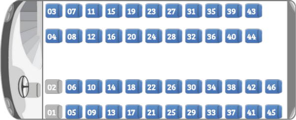
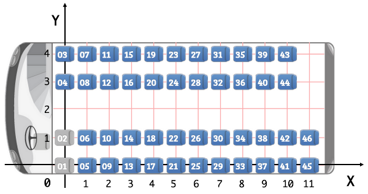
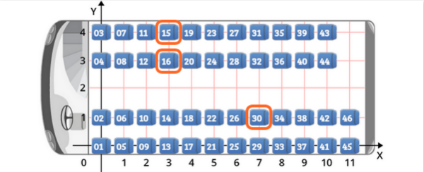

FORMAT: 1A

# Clickbus Public API

This is the documentation and samples for Clickbus Public API. Also this can be used as mocked data to simply test API integration.

In this documentation you may find both how to integrate with Clickbus API for any country avaliable in Clickbus Portifolio but also use as a guideline to create your own Booking engine and submit to us to quickly implement your services and start selling your bus services as well using clickbus (contato@clickubs.com.br for more commercial details).

### **Overview**

Below are the topic Groups to perform every task for your applications:

- Obtain a list with all **Places**;
- Search any of our **Trips**;
- Get all information about the available **Payment** methods;
- Obtain **Trip Details** from each route;
- **Seat Block** to lock or unlock seat reservations;
- **Booking** orders;
- Sign your actions with an ID provided by **Session**.

# API Reference

## **Predicates**

1. All sucessfull requests return a **20*** Response header;
2. All requests that may lack a given parameter, which is required, will return a **400** Response header, along with a body message as below:
    ```json
    {
        "message":"Invalid Parameters"
    }
    ```
3. The **Evaluation** environment (https://api-evaluation.clickbus.com.br/api/v1) have only 1 possible trip: from **Sao Paulo, SP - Tiete** (`sao-paulo-tiete-sp`) to **Santos, SP** (`santos-sp`), and vice-versa.
4. The params **store**, **model** and **platform** are required and singular for each partner. To obtain these credentials, please contact our commercial department at contato@clickbus.com.br.

## **Groups**

# Group Places

## Get All Places [/places]

The resource `/places` retrieves all the available Places, where each Place can be used as a destination point to our travels and routes.

One of the most important values on this resource is the `slug`, which contains the name to use when referencing to a Place in a **Trips** request.

### Get All Places [GET]

**Parameters**

_None_

**Response**

The given request returns a Response _200_, with a list in JSON format filled with all Places:

**Example**

 ```json
 {
    "meta": "",
    "items": [{
        "id": 4017,
        "station_id": 34523,
        "slug": "sao-paulo-tiete-sp",
        "locale": "pt-BR",
        "name": "",
        "is_primary": "true",
        "created_at": "2014-09-05 13:04:27",
        "updated_at": "2014-09-05 13:04:59",
        "place": {
            "id": 34523,
            "place_id": 4017,
            "locale": "pt-BR",
            "name": "Sao Paulo, SP - Tiete",
            "created_at": "2014-09-05 13:04:27",
            "updated_at": "2014-09-05 13:04:59",
            "latitude": "",
            "longitude": "",
            "state": {
                "code": "",
                "name": "Sao Paulo, SP - Tiete"
            }
        }
    }, {
        "id": 9209,
        "station_id": 7648,
        "slug": "santos-sp",
        "locale": "pt-BR",
        "name": "Santos, SP",
        "is_primary": "true",
        "created_at": "2014-05-26 16:19:36",
        "updated_at": "2014-05-26 16:38:32",
        "place": {
            "id": 7648,
            "place_id": 7648,
            "locale": "pt-BR",
            "name": "Santos, SP",
            "created_at": "2014-05-26 16:19:36",
            "updated_at": "2014-05-26 16:38:32",
            "latitude": "",
            "longitude": "",
            "state": {
                "code": "",
                "name": "Santos, SP"
            }
        }
    }, {...}]
}
 ```

# Group Trips

## Get all available Trips [/trips]

The resource `/trips` provides a list with all available trips, with all sort of details you may need.

**ADVICE:** Remember that each request to `/trips` will erase all itens stored in your Pre-Order, so, if you don't have confirmed your Order yet, all the items added to the Pre-Order will be lost.

### Get all available Trips [GET]

**Parameters**

|PARAMS|VALUE|DESCRIPTION|EXAMPLE|
|:----|:----|:----|:----|
|**from** (required)|_string_|A destination from where a trip starts.|`sao-paulo-tiete-sp`|
|**to** (required)|_string_|A destination to where a trip ends.|`santos-sp`|
|**departure** (required)|_date_|Any valid date, in format `yyyy-mm-dd`.|`2015-02-11`|
|**engine** (optional)|_string_|Specify in what booking engine you want to perform the search; if not provided, the search will be executed in the availiable booking engine on the server.|`5411E7D726991`|

**Response**

With the correct params, this resource returns a Response _200_ and a list, in JSON format, with these details as follow:

- `items`, which have:
    - `from` and `to` destinations;
    - `parts` section, which contains:
        - `waypoint` information, such as `schedule` for each waypoint, including `price`, `date` and `time`;
        - Which `busCompany` offer these travels;
        - `availableSeats` provides how many seats are available.

**Examples**

 - Searching for travels from _Sao Paulo, SP - Tiete_ to _Santos, SP_ in _11th Feb 2015_, with all correct params:

    - URL:
        ```
        api/v1/trips?from=sao-paulo-tiete-sp&to=santos-sp&departure=2015-02-11
        ```
    - Response:
        ```json
        {
            "meta": "",
            "items": [{
                "from": "Sao Paulo, SP - Tiete",
                "to": "Santos, SP",
                "parts": [{
                    "trip_id": "2949",
                    "departure": {
                        "price": "2191",
                        "waypoint": {
                            "id": "4016",
                            "prices": [{
                                "waypoint": "3935",
                                "price": "2191"
                            }],
                            "schedule": {
                                "id": "NDAxNi0tMzkzNS0tMjAxNS0wMi0xMSAwMTowMC0tNy0tMjk0OS0tMS0tMS0tMS0tQ09OVg==",
                                "date": "2015-02-11",
                                "time": "01:00",
                                "timezone": "America/Sao_Paulo"
                            },
                            "context": "departure",
                            "place": {
                                "country": "BRA",
                                "state": "",
                                "city": "Sao Paulo, SP - Tiete",
                                "station": {
                                    "current": {
                                        "id": "4016",
                                        "name": "Sao Paulo, SP - Tiete",
                                        "locale": "en_US"
                                    },
                                    "default": {
                                        "id": "",
                                        "name": "",
                                        "locale": ""
                                    }
                                },
                                "locale": "pt_BR",
                                "id": "4016"
                            },
                            "isDeparture": "true",
                            "position": "0"
                        }
                    },
                    "arrival": {
                        "price": "2191",
                        "waypoint": {
                            "id": "3935",
                            "prices": [{
                                "waypoint": "",
                                "price": ""
                            }],
                            "schedule": {
                                "id": "NDAxNi0tMzkzNS0tMjAxNS0wMi0xMSAwMTowMC0tNy0tMjk0OS0tMS0tMS0tMS0tQ09OVg==",
                                "date": "2015-02-11",
                                "time": "02:10",
                                "timezone": "America/Sao_Paulo"
                            },
                            "context": "arrival",
                            "place": {
                                "country": "BRA",
                                "state": "",
                                "city": "Santos, SP",
                                "station": {
                                    "current": {
                                        "id": "111",
                                        "name": "Santos, SP",
                                        "locale": "pt_BR"
                                    },
                                    "default": {
                                        "id": "",
                                        "name": "",
                                        "locale": ""
                                    }
                                },
                                "locale": "pt_BR",
                                "id": "3935"
                            },
                            "isDeparture": "false",
                            "position": "0"
                        }
                    },
                    "busCompany": {
                        "name": "Cometa",
                        "id": "7"
                    },
                    "bus": {
                        "serviceClass": "Convencional",
                        "name": "Convencional",
                        "id": "1"
                    },
                    "waypoints": [{
                        "id": "4016",
                        "prices": [{
                            "waypoint": "3935",
                            "price": "2191"
                        }],
                        "schedule": {
                            "id": "NDAxNi0tMzkzNS0tMjAxNS0wMi0xMSAwMTowMC0tNy0tMjk0OS0tMS0tMS0tMS0tQ09OVg==",
                            "date": "2015-02-11",
                            "time": "01:00",
                            "timezone": "America/Sao_Paulo"
                        },
                        "context": "departure",
                        "place": {
                            "country": "BRA",
                            "state": "São Paulo",
                            "city": "São Paulo",
                            "station": {
                                "current": {
                                    "id": "4016",
                                    "name": "Sao Paulo, SP - Tiete",
                                    "locale": "pt_BR"
                                },
                                "default": {
                                    "id": "",
                                    "name": "",
                                    "locale": ""
                                }
                            },
                            "locale": "pt_BR",
                            "id": "123"
                        },
                        "isDeparture": "true",
                        "position": "0"
                    },
                    {
                        "id": "3935",
                        "prices": [{
                            "waypoint": "",
                            "price": "2191"
                        }],
                        "schedule": {
                            "id": "NDAxNi0tMzkzNS0tMjAxNS0wMi0xMSAwMTowMC0tNy0tMjk0OS0tMS0tMS0tMS0tQ09OVg==",
                            "date": "2015-02-11",
                            "time": "01:00",
                            "timezone": "America/Sao_Paulo"
                        },
                        "context": "arrival",
                        "place": {
                            "country": "BRA",
                            "state": "",
                            "city": "Santos, SP",
                            "station": {
                                "current": {
                                    "id": "3935",
                                    "name": "Santos, SP",
                                    "locale": "pt_BR"
                                },
                                "default": {
                                    "id": "",
                                    "name": "",
                                    "locale": ""
                                }
                            },
                            "locale": "pt_BR",
                            "id": ""
                        },
                        "isDeparture": false,
                        "position": 0
                    }],
                    "seatTypes": [],
                    "products": [],
                    "availableSeats": "44"
                }]
            }]
        }
        ```
- Searching for travels from _Sao Paulo, SP - Tiete_ to _Santos, SP_ using an incorrect or even an unavailable date value on _departure_:
    - URL:
        
        For an incorrect value, like `99/99/9999`:
        ```
        api/v1/trips?from=sao-paulo-tiete-sp&to=santos-sp&departure=9999-99-99
        ``` 
        For an unavailable value, like `1th January, 2010`:
        ```
        api/v1/trips?from=sao-paulo-tiete-sp&to=santos-sp&departure=2010-01-01
        ``` 
    - Response:
        ```json
        {
            "meta": "",
            "items": []
        }
        ```

# Group Session

## Get Session [/session]

The resource `/session` retrieves the current Session ID, which is useful to obtain data from the current session, like add a reservation by locking a seat using the **Seat Block** resource.

**NOTE:** The token have a lifetime of ~15 minutes. After that, the token is expired, so you have to execute a new request to `/session` to generate a new token.

### Get Session [GET]

**Parameters**

_None_

**Response**

The given request returns a Response _201_, and the session ID on the Response Body, as follow:

**Example**

 - Sucessfull request:

    - URL:
        ```
        api/v1/session
        ```
    - Response:
        ```json
        {
            "content": "or8k5s91s66fsl3bp6ksu96qs7"
        }
        ```

# Group Trip Details

## Get Trip Details [/trip]

The resource `/trip` return all information related to a specific trip, based on a given schedule ID (check **Trips** resource for more details).

### Get Trip Details [GET]

**Parameters**

|PARAMS|VALUE|DESCRIPTION|EXAMPLE|
|:----|:----|:----|:----|
|**scheduleId** (required)|_string_|A given hash from a search part. See on **Trips** resource, in the output, into each `items` part, the value on `departure.waypoint.schedule.id` node. |`NDAxNi0tMzkzNS0tMjAxNS0wMi0xMSAwM...`|

**Response**

Using a valid `scheduleId`, the request will return a _200_ Response, with the structure as described below:

- `sessionId`, which is the current session's ID;
    - `content`, containing:
        - `trip_id` which is the trip ID (each trip has it's own ID);
        - The `busCompany` name;
        - The `bus` vehicle itself;
        - Each bus seat is listed on `seats`, with:
            - A single `id`;
            - The seat's `name`;
            - If the seat is `available` or not:
                - `"1"` if the Seat is available; otherwise, it will return an empty string (`""`).
            - The seat `position`, which is useful to understand how the **Seat** proccess works, distributed in:
                - `x` is for the horizontal axis;
                - `y` is for the vertical axis;
                - **NOTE:** the `z` value is only required for double-decker vehicles.
            - The seat `details`, which provides:
                - Seat's `price`, `currency` and `seatTypes`.

**Examples**

- Get the trip details from _Sao Paulo, SP - Tiete_ to _Santos, SP_ in _11th Feb 2015_ from a single part of this search.

    - URL:
        ```
        api/v1/trip?scheduleId=NDAxNi0tMzkzNS0tMjAxNS0wMi0xMSAwMTowMC0tNy0tMjk0OS0tMS0tMS0tMS0tQ09OVg==
        ```
    - Response:
        ```json
        {
            "meta": {},
            "sessionId": "oeccq3hugiknuj5f2luvvruvj7",
            "content": {
                "trip_id": "2949",
                "busCompany": {
                    "name": "Cometa"
                },
                "bus": {
                    "id": "",
                    "name": ""
                },
                "seats": [{
                    "id": "01",
                    "name": "01",
                    "available": "",
                    "position": {
                        "x": "1",
                        "y": "0",
                        "z": ""
                    },
                    "details": {
                        "price": "2191",
                        "currency": "R$",
                        "seatTypes": []
                    }
                }, {...}
                ]
            }
        }
        ```
- Incorrect request (using a invalid or incorrect schedule ID):
    - URL:
        ```
        api/v1/trip?scheduleId=0123456789abcdefghijklmnopqrstuvxz
        ``` 
    - Response (status code: _400_):
        ```json
        {
            "message": "Invalid Parameters"
        }
        ```


## How Seat Position works [/trip]

According to the explanation about the `seats` node information, retrieved on `/trip` resource, the Seat manipulation is as follow:

Let's have a look back to our `seats` node, found inside the `/trip` Response:

```json
{
    "seats": [{
        "id": "01",
        "name": "01",
        "available": "",
        "position": {
            "x": "1",
            "y": "0",
            "z": ""
        },
        "details": {
            "price": "2191",
            "currency": "R$",
            "seatTypes": []
        }
    }]
}
```

The concept here is pretty simple: in the `position` node, we have 3 different values:

- `x`, which represents the horizontal axis;
- `y`, which represents the horizontal axis;
- `z`, which we may disconsider by now (it's only applied for double-decker vehicles).

Consider the image below:



In this image, we can represent the Seat manipulation as an array, with X and Y axis:



So, if you have the following coordinates: `{(X: 3, Y: 3),(X: 3, Y: 4),(X: 7, Y: 1)}`, you have selected the the following Seats, in sequence:

- `(X: 3, Y: 3)` stands for Seat `"name": "16"`;
- `(X: 3, Y: 4)` stands for Seat `"name": "15"`;
- `(X: 7, Y: 1)` stands for Seat `"name": "30"`;




# Group Seat Block

## Create a block in a Seat [/seat-block]

This request creates a block in a Seat, which indicates that this Seat is now unavailable for other passengers.

**NOTES:**

1. This block may last ~10 minutes. After that, the seat is available again;
2. Every Request's header shall declare the key `PHPSESSID`, along with it's value, Session's ID (obtained on **Session**), as follow:
    > Cookie: PHPSESSID=g1898g0ogdlh9f3mfra2hl3el3
3. You can create up to 5 Seat blocks per Order.


### Create a block in a Seat [PUT]

**Parameters**

|PARAMS|VALUE|DESCRIPTION|EXAMPLE|
|:----|:----|:----|:----|
|**meta** (required)|_object_|An empty object. Partners can use this parameter to provide their own `meta` information: `store`, `platform` and `model`. |`{}`|
|**request** (required)|_object_|A container which requires: ||
|**request.from** (required)|_string_|A destination from where a trip starts. Same value used on **Trips**.|`sao-paulo-tiete-sp`|
|**request.to** (required)|_string_|A destination to where a trip ends. Same value used on **Trips**.|`santos-sp`|
|**request.seat** (required)|_string_|The seat’s `name`, obtained on **Trip Details**.|`07`|
|**request.passenger** (required)|_object_|A container which contains multiple items, one for each passenger: ||
|**request.passenger.name** (required)|_string_|Passenger's name.|`Fulano da Silva`|
|**request.passenger.document** (required)|_string_|Passenger's document.|`123.456.789-00`|
|**request.passenger.documentType** (required)|_string_|Type of the passenger's `document`.|`"cpf"`|
|**request.passenger.gender** (required)|_string_|`M` stands for _Male_, and `F`, for _Female_.|`M` or `F`|
|**request.schedule** (required)|_object_|A container which requires: ||
|**request.schedule.id** (required)|_string_|Schedule's ID, obtained from **Trip Details**.|`NDAxNy0tMzkzNS0tMjAxNS0wMi0xMSAw...`|
|**request.schedule.date** (required)|_string_|Any valid date, in format `yyyy-mm-dd`. Use the same value applied on **Trips**.|`2015-01-27`|
|**request.schedule.time** (required)|_string_|Any valid time between `00:00` and `23:59`, in format `HH:ii`.|`10:30`|
|**request.schedule.timezone** (required)|_string_|Timezone information, based on actual country.|`America/Sao_Paulo`|
|**request.sessionId** (required)|_string_|Session's ID, obtained from **Session**.|`dnlfm8aecg2omtjaang62fvla5`|

**Request**

- Created a block for a Seat, named _07_, on a travel from _Sao Paulo, SP - Tiete_ to _Santos, SP_ in _27th January 2015_, with all params correct:

    ```json
    {
        "meta": {},
        "request": {
            "from": "sao-paulo-tiete-sp",
            "to": "santos-sp",
            "seat": "07",
            "passenger": {
                "name": "Fulano da Silva",
                "document": "123.456.789-00",
                "documentType": "cpf",
                "gender": "M"
            },
            "schedule": {
                "id": "NDAxNy0tMzkzNS0tMjAxNS0wMi0xMSAwMTowMC0tOS0tNDMyMi0tMS0tMS0tMS0tQ09OVg==",
                "date": "2015-01-27",
                "time": "10:30",
                "timezone": "America/Sao_Paulo"
            },
            "sessionId": "dnlfm8aecg2omtjaang62fvla5"
        }
    }
    ```

**Response**

This request, with all correct params and being executed before the Seat block's life time ends, will return a Response _200_, with the following Response body:

```json
{
    "meta": {},
    "items": [{
        "seat": "07",
        "schedule": {
            "id": "NDAxNy0tMzkzNS0tMjAxNS0wMi0xMSAwMTowMC0tOS0tNDMyMi0tMS0tMS0tMS0tQ09OVg==",
            "date": "",
            "time": "",
            "timezone": "America/Sao_Paulo"
        },
        "status": "blocked",
        "sessionId": "dnlfm8aecg2omtjaang62fvla5",
        "expireAt": "2015-01-20 17:46"
    }]
}
```

**NOTE:** If, while a Request to create a Seat Block, the selected Seat is already blocked by other Request executed previously, you may receive the following _400_ Response:

```json
{
    "message":"Busy seat"
}
```

## Remove a block in a Seat [/seat-block]

As opposed to the Create proccess, the Remove will delete a block created on a Seat, which automatically turns a Seat available for all passengers.

**NOTE:**

- Every Request's header shall declare the key `PHPSESSID`, along with it's value, Session's ID (obtained on **Session**), as follow:
    > Cookie: PHPSESSID=g1898g0ogdlh9f3mfra2hl3el3

### Remove a block in a Seat [DELETE]

**Parameters**

|PARAMS|VALUE|DESCRIPTION|EXAMPLE|
|:----|:----|:----|:----|
|**meta** (required)|_object_|An empty object. Partners can use this parameter to provide their own `meta` information: `store`, `platform` and `model`. |`{}`|
|**request** (required)|_object_|A container which requires: ||
|**request.seat** (required)|_string_|The seat’s `name`, obtained on **Trip Details**.|`07`|
|**request.schedule** (required)|_object_|A container which requires: ||
|**request.schedule.id** (required)|_string_|Schedule's ID, obtained from **Trip Details**.|`NDAxNy0tMzkzNS0tMjAxNS0wMi0xMSAw...`|
|**request.sessionId** (required)|_string_|Session's ID, obtained from **Session**.|`dnlfm8aecg2omtjaang62fvla5`|

**Request**

- Removing the Seat block, named _07_, on a travel from _Sao Paulo, SP - Tiete_ to _Santos, SP_ in _27th January 2015_, with all params correct:

    ```json
    {
        "meta": {},
        "request": {
            "seat": "07",
            "schedule": {
                "id": "NDAxNy0tMzkzNS0tMjAxNS0wMi0xMSAwMTowMC0tOS0tNDMyMi0tMS0tMS0tMS0tQ09OVg=="
            },
            "sessionId": "dnlfm8aecg2omtjaang62fvla5"
        }
    }
    ```

**Response**

This request, with all correct params, will return a Response _202_, with the following Response body:

```json
{
    "meta": {},
    "content": {
        "status": "canceled",
        "messages": [],
        "sessionId": "dnlfm8aecg2omtjaang62fvla5"
    }
}
```

**NOTE** If the `sessionId` or the lifetime of the Seat block have already expired, you may obtain a _400_ Response with the following Response body:

```json
{
    "message": "Invalid Parameters"
}
```

# Group Payment

## Get all Payment settings [/payment]

The resource `/payment` retrieves all the information that you need according to your `meta` parameters, which are:

- `model`
- `store`
- `platform`

These parameters are created for each partner, and they are required for each request. If you have any doubts or questions about how to obtain these values, please contact our commercial department at contato@clickubs.com.br.

### Get all Payment settings [GET]

**Parameters**

|PARAMS|VALUE|DESCRIPTION|EXAMPLE|
|:----|:----|:----|:----|
|**store** (required)|_string_|`store` parameter. A specific param for each partner. Please contact ClickBus at contato@clickubs.com.br for more commercial details.|`clickbus`|
|**model** (required)|_string_|`model` parameter. A specific param for each partner. Please contact ClickBus at contato@clickubs.com.br for more commercial details.|`retail`|
|**platform** (required)|_string_|`platform` parameter. A specific param for each partner. Please contact ClickBus at contato@clickubs.com.br for more commercial details.|`web`|

**Response**

With the correct params, this resource returns a Response _200_ and a list, in JSON format, with these details as follow:

- `paymentSettings`, like:
    - `creditcard`, with it's own `serviceFee` and `serviceFeePercentage` which is attributed for each partner (contact ClickBus at contato@clickubs.com.br for more commercial details);
    - `debitcard`, `paypal_hpp` and `banktransfer` information;

**Examples**

- A request, with all valid parameters:

    - URL:
        ```
        /api/v1/payment?store=clickbus&platform=web&model=retail
        ```
    - Response:
        ```json
        {
            "meta": {},
            "paymentSettings": {
                "bankslip": {
                    "total": "0.00",
                    "discount_id": 0,
                    "discount_type": 0,
                    "discount_value": 0,
                    "savings": 0,
                    "fixedValue": 0,
                    "serviceFee": 0,
                    "serviceFeePercentage": 0
                },
                "creditcard": {
                    "total": {
                        "1": "0.00",
                        "2": "0.00",
                        "3": "0.00",
                        "4": "0.00",
                        "5": "0.00",
                        "6": "0.00",
                        "7": "0.00",
                        "8": "0.00",
                        "9": "0.00",
                        "10": "0.00",
                        "11": "0.00",
                        "12": "0.00"
                    },
                    "discount_id": 0,
                    "discount_type": 0,
                    "discount_value": 0,
                    "savings": 0,
                    "fixedValue": 0,
                    "serviceFee": {
                        "1": 0,
                        "2": 0,
                        "3": 0,
                        "4": 0,
                        "5": 0,
                        "6": 0,
                        "7": 0,
                        "8": 0,
                        "9": 0,
                        "10": 0,
                        "11": 0,
                        "12": 0
                    },
                    "serviceFeePercentage": {
                        "1": "0.00",
                        "2": "0.00",
                        "3": "0.00",
                        "4": "0.00",
                        "5": "0.00",
                        "6": "0.00",
                        "7": "0.00",
                        "8": "0.00",
                        "9": "0.00",
                        "10": "0.00",
                        "11": "0.00",
                        "12": "0.00"
                    }
                },
                "debitcard": {
                    "total": "0.00",
                    "discount_id": 0,
                    "discount_type": 0,
                    "discount_value": 0,
                    "savings": 0,
                    "fixedValue": 0,
                    "serviceFee": 0,
                    "serviceFeePercentage": 0
                },
                "paypal_hpp": {
                    "total": "0.00",
                    "discount_id": 0,
                    "discount_type": 0,
                    "discount_value": 0,
                    "savings": 0,
                    "fixedValue": 0,
                    "serviceFee": 0,
                    "serviceFeePercentage": 0
                },
                "banktransfer": {
                    "total": "0.00",
                    "discount_id": 0,
                    "discount_type": 0,
                    "discount_value": 0,
                    "savings": 0,
                    "fixedValue": 0,
                    "serviceFee": 0,
                    "serviceFeePercentage": "13.00"
                }
            }
        }
        ```

# Group Booking

## Create an Order [/booking]

When you have selected all the Seats, then you may proceed to create an Order, which will start the payment process.

**NOTES:**

- For every Response, please remember to keep the `content.localizer` content; this value is required for any **Update Order** Request;
- Please keep in mind that you need to provide in your header the `PHPSESSID` key with the Session's ID in the Cookie, as below:
    > Cookie: PHPSESSID=g1898g0ogdlh9f3mfra2hl3el3

### Create an Order [POST]

To create an Order, the request's body requires a range of data, which, for a better understanding, we will divide in the following blocks below:

- **meta**, which contains the params `model`, `store` and `platform` for each Partner;
- **request**, which contains:
    - **request.buyer** contains all required information about the Buyer;
        - **request.buyer.payment** contains all the Buyer's payment data;
    - **request.orderItems** contains all the Seats, along with their information, added to the Order.

Each `/booking` have the same structure block except for `payment` block, which is based on each payment method (see details below):

|PARAMS|VALUE|DESCRIPTION|EXAMPLE|
|:----|:----|:----|:----|
|**meta** (required)|_object_|An empty object. Partners can use this parameter to provide:|`{}`|
|**meta.model** (required)|_string_|Partner's `model` data. |`retail`|
|**meta.store** (required)|_string_|Partner's `store` data. |`newstore`|
|**meta.platform** (required)|_string_|Partner's `platform` data. |`web`|
|**request** (required)|_object_|A container which requires: ||
|**request.sessionId** (required)|_string_|Session's ID, obtained from **Session**.|`dnlfm8aecg2omtjaang62fvla5`|
|**request.buyer** (required)|_object_|A container which requires: ||
|**request.buyer.locale** (required)|_string_|Buyer's locale.|`pt_BR`|
|**request.buyer.firstName** (required)|_string_|Buyer's first name.|`Fulano`|
|**request.buyer.lastName** (required)|_string_|Buyer's surname.|`de Silva`|
|**request.buyer.email** (required)|_string_|Buyer's email.|`fulano@teste.com.br`|
|**request.buyer.phone** (required)|_string_|Buyer's phone, in format `AABBBBBBBBB`, where `AA` stands for the brazilian phone's region code, and `BBBBBBBBB` stands for the phone number.|`11912345678`|
|**request.buyer.document** (required)|_string_|Buyer's document.|`123.456.789-00`|
|**request.buyer.gender** (required)|_string_|`M` stands for _Male_, and `F`, for _Female_.|`M` or `F`|
|**request.buyer.birthday** (required)|_string_|Buyer's birth date, in format `yyyy-mm-dd`.|`1970-01-15`|
|**request.buyer.meta** (required)|_object_|An empty object.|`{}`|
|**request.buyer.payment** (required)|_object_|An object containing all the required information according to the payment method.||
|**request.orderItems** (required)|_object_|A collection of objects, which may contain at least 1 and a maximum of N to be considered valid. Each object contains:||
|**request.orderItems.seatReservation** (required)|_string_|Schedule's ID, obtained in the **Seat** process.|`NDAxNy0tMzkzNS0tMjAxNS0...`|
|**request.orderItems.passenger** (required)|_object_|A container, which have:||
|**request.orderItems.passenger.firstName** (required)|_string_|Passenger's first name.|`Beltrano`|
|**request.orderItems.passenger.lastName** (required)|_string_|Passenger's surname.|`da Silva`|
|**request.orderItems.passenger.email** (required)|_string_|Passenger's email.|`beltrano@teste.com.br`|
|**request.orderItems.passenger.document** (required)|_string_|Passenger's document.|`123.456.789-00`|
|**request.orderItems.passenger.gender** (required)|_string_|`M` stands for _Male_, and `F`, for _Female_.|`M` or `F`|
|**request.orderItems.passenger.birthday** (required)|_string_|Passenger's birth date, in format `yyyy-mm-dd`.|`1970-01-15`|
|**request.orderItems.passenger.seat** (required)|_string_|`seat` name, obtained on **Seat** proccess.|`08`|
|**request.orderItems.passenger.meta** (required)|_object_|An empty object.|`{}`|
|**request.orderItems.products** (optional)|_array_|A collection of objects, which may have:|`{}`|
|**request.orderItems.products.uuid** (optional)|_string_||`abcd123s`|
|**request.orderItems.products.quantity** (optional)|_int_||`{}`|

 The `/booking` request have the 3 valid payment methods:

- **Credit Card**
- **Debit Card**
- **PayPal**

Based on each of the 3 valid payment methods:

**1) Payment method: Credit Card**

**Parameters**

|PARAMS|VALUE|DESCRIPTION|EXAMPLE|
|:----|:----|:----|:----|
|**request.buyer.payment.method** (required)|_string_|Payment type: `creditcard`.|`creditcard`|
|**request.buyer.payment.currency** (required)|_string_|Payment currency.|`BRL`|
|**request.buyer.payment.total** (required)|_int_|Sum of the values of all items in the Order. The first two digits from right to left represent the decimal part of the value. So, for instance, `1400` means `14.00`, and `6050` means `60.50`.|`1400`|
|**request.buyer.payment.installment** (required)|_int_|Indicates on how many installments the payment is settled.|`1`|
|**request.buyer.payment.meta** (required)|_object_|An object which requires the following data:||
|**request.buyer.payment.meta.card** (required)|_string_|Credit card's number.|`1234567812345678`|
|**request.buyer.payment.meta.code** (required)|_string_|Credit card's security code.|`065`|
|**request.buyer.payment.meta.name** (required)|_string_|Credit card owner's name, in all upper case.|`CICRANO SILVA`|
|**request.buyer.payment.meta.expiration** (required)|_string_|Credit card's expiration date, in format `yyyy-mm`.|`2016-02`|
|**request.buyer.payment.meta.zipcode** (required)|_string_|Credit card owner's zip code, with only digits.|`12345678`|

**Request - Example**

- Create an Order with the following data:
    - Created from a `store` called _NewWorld_;
    - Selected 1 Seat for _Fulano da Silva_ and 1 Seat for _Beltrano da Silva_ in the same Order;
    - Each item costs R$ 12.35, so the `request.buyer.payment.total` value is _2470_;
    - The payment is settled to a single `installment`, using `creditcard`.

        ```json
        {
            "meta": {
                "model": "foo",
                "store": "newworld",
                "platform": "bar"
            },
            "request": {
                "sessionId": "oeccq3hugiknuj5f2luvvruvj7",
                "buyer": {
                    "locale": "pt_BR",
                    "firstName": "Cicrano",
                    "lastName": "da Silva",
                    "email": "cicrano@teste.com.br",
                    "phone": "12934567890",
                    "document": "123.456.789-00",
                    "gender": "M",
                    "birthday": "1986-05-17",
                    "meta": {},
                    "payment": {
                        "method": "creditcard",
                        "currency": "BRL",
                        "total": 2470,
                        "installment": "1",
                        "meta": {
                            "card": "1234567887654321",
                            "code": "093",
                            "name": "DELTRANO SILVA",
                            "expiration": "2022-03",
                            "zipcode": "12345678"
                        }
                    }
                },
                "orderItems": [
                    {
                        "seatReservation": "NDAxNy0tMzkzNS0tMjAxNS0wMS0wMSAwMTowMC0tOS0tNDMyMS0tMS0tMS0tMS0tQ09OVg==",
                        "passenger": {
                            "firstName": "Fulano",
                            "lastName": "da Silva",
                            "email": "fulano@teste.com.br",
                            "document": "123.123.123-01",
                            "gender": "M",
                            "birthday": "1986-05-17",
                            "seat": "11",
                            "meta": {}
                        },
                        "products": [{
                            "uuid": "abcd123s",
                            "quantity": 1
                        }
                    },
                    {
                        "seatReservation": "NDAxNy0tMzkzNS0tMjAxNS0wMS0wMSAwMTowMC0tOS0tNDMyMS0tMS0tMS0tMS0tQ09OVg==",
                        "passenger": {
                            "firstName": "Beltrano",
                            "lastName": "da Silva",
                            "email": "beltrano@teste.com.br",
                            "document": "987.654.321-99",
                            "gender": "M",
                            "birthday": "1942-10-17",
                            "seat": "02",
                            "meta": {}
                        },
                        "products": [{
                            "uuid": "abcd123s",
                            "quantity": 1
                        }]
                    }
                ]
            }
        }
        ```

**Response**

The following Request, with all correct parameters, will return a _201_ Response, with all details from the Order, as the example below.

```json
{
    "meta": {
        "model": "corporate",
        "store": "clickbus",
        "platform": "Web"
    },
    "content": {
        "id": "1062",
        "status": "order_finalized_successfully",
        "localizer": "5EBP2M",
        "uuid": "",
        "payment": {
            "method": "payment.creditcard",
            "total": "6.3",
            "currency": "BRL",
            "status": "order_finalized_successfully",
            "meta": {
                "card": "4111-XXXX-XXXX-1111",
                "code": "XXX",
                "name": "NOME DE TESTE DA COMPRA",
                "expiration": "XXXX-XX-XX",
                "postbackUrl": "",
                "callbackUrl": ""
            }
        },
        "items": [{
            "trip_id": "4321",
            "localizer": "KPFHNB",
            "context": "departure",
            "order_item": "1228",
            "serviceClass": "Convencional",
            "departure": {
                "waypoint": "4017",
                "schedule": {
                    "id": "",
                    "date": "2015-02-11",
                    "time": "01:00",
                    "timezone": "America/Sao_Paulo"
                }
            },
            "arrival": {
                "waypoint": "3935",
                "schedule": {
                    "id": "",
                    "date": "2015-02-11",
                    "time": "03:00",
                    "timezone": "America/Sao_Paulo"
                }
            },
            "seat": {
                "id": "42",
                "name": "42",
                "price": "6.30",
                "status": "reserved",
                "currency": "BRL",
                "type": {}
            },
            "passenger": {
                "firstName": "Nome Passageiro",
                "lastName": "",
                "email": "passageiro@teste.com.br",
                "document": "123.456.789-00",
                "gender": "",
                "birthday": "",
                "meta": {}
            },
            "products": [],
            "subtotal": "6.30"
        }],
        "createdAt": "2015-01-23"
    }
}
```

**2) Payment method: Debit Card**

**Parameters**

|PARAMS|VALUE|DESCRIPTION|EXAMPLE|
|:----|:----|:----|:----|
|**request.buyer.payment.method** (required)|_string_|Payment type: `debitcard`.|`debitcard`|
|**request.buyer.payment.currency** (required)|_string_|Payment currency.|`BRL`|
|**request.buyer.payment.total** (required)|_int_|Sum of the values of all items in the Order. The first two digits from right to left represent the decimal part of the value. So, for instance, `1400` means `14.00`, and `6050` means `60.50`.|`1400`|
|**request.buyer.payment.installment** (required)|_int_|Indicates on how many installments the payment is settled.|`1`|
|**request.buyer.payment.meta** (required)|_object_|An object which requires the following data:||
|**request.buyer.payment.meta.card** (required)|_string_|Debit card's number.|`1234567812345678`|
|**request.buyer.payment.meta.code** (required)|_string_|Debit card's security code.|`065`|
|**request.buyer.payment.meta.name** (required)|_string_|Debit card owner's name, in all upper case.|`CICRANO SILVA`|
|**request.buyer.payment.meta.expiration** (required)|_string_|Debit card's expiration date, in format `yyyy-mm`.|`2016-02`|
|**request.buyer.payment.meta.zipcode** (required)|_string_|Debit card owner's zip code, with only digits.|`12345678`|

**Request - Example**

- Create an Order with the following data:
    - Created from a `store` called _NewWorld_;
    - Selected 1 Seat for _Fulano da Silva_;
    - Each item costs R$ 22.50, so the `request.buyer.payment.total` value is _2250_;
    - The payment is settled to a single `installment`, using `debitcard`.

        ```json
        {
            "meta": {
                "model": "foo",
                "store": "newworld",
                "platform": "bar"
            },
            "request": {
                "sessionId": "oeccq3hugiknuj5f2luvvruvj7",
                "buyer": {
                    "locale": "pt_BR",
                    "firstName": "Cicrano",
                    "lastName": "da Silva",
                    "email": "cicrano@teste.com.br",
                    "phone": "12934567890",
                    "document": "123.456.789-00",
                    "gender": "M",
                    "birthday": "1986-05-17",
                    "meta": {},
                    "payment": {
                        "method": "debitcard",
                        "currency": "BRL",
                        "total": 2250,
                        "installment": "1",
                        "meta": {
                            "card": "1234567887654321",
                            "code": "093",
                            "name": "DELTRANO SILVA",
                            "expiration": "2022-03",
                            "zipcode": "12345678"
                        }
                    }
                },
                "orderItems": [
                    {
                        "seatReservation": "NDAxNy0tMzkzNS0tMjAxNS0wMS0wMSAwMTowMC0tOS0tNDMyMS0tMS0tMS0tMS0tQ09OVg==",
                        "passenger": {
                            "firstName": "Fulano",
                            "lastName": "da Silva",
                            "email": "fulano@teste.com.br",
                            "document": "123.123.123-01",
                            "gender": "M",
                            "birthday": "1986-05-17",
                            "seat": "11",
                            "meta": {}
                        },
                        "products": [{
                            "uuid": "abcd123s",
                            "quantity": 1
                        }
                    }
                ]
            }
        }
        ```

**Response**

Attention to `content.payment.meta.continuePaymentURL`, which contains the URL to redirect after payment.

```json
{
    "meta": {
        "model": "foo",
        "store": "newworld",
        "platform": "bar"
    },
    "content": {
        "id": "1064",
        "status": "clarify_debit_card_payment_pending",
        "localizer": "EXQMD5",
        "uuid": "",
        "payment": {
            "method": "payment.debitcard",
            "total": "6.3",
            "currency": "BRL",
            "status": "clarify_debit_card_payment_pending",
            "meta": {
                "continuePaymentURL": "https://qasecommerce.cielo.com.br/web/index.cbmp?id=43b07288a66a8e2fd86bb693d4af426b",
                "card": "4111-XXXX-XXXX-1111",
                "code": "XXX",
                "name": "NOME SOBRENOME",
                "expiration": "XXXX-XX-XX",
                "postbackUrl": "",
                "callbackUrl": ""
            }
        },
        "items": [{
            "trip_id": "2311",
            "context": "departure",
            "order_item": "1230",
            "serviceClass": "Convencional",
            "departure": {
                "waypoint": "4017",
                "schedule": {
                    "id": "",
                    "date": "2015-02-11",
                    "time": "02:00",
                    "timezone": "America/Sao_Paulo"
                }
            },
            "arrival": {
                "waypoint": "3935",
                "schedule": {
                    "id": "",
                    "date": "2015-02-11",
                    "time": "12:15",
                    "timezone": "America/Sao_Paulo"
                }
            },
            "seat": {
                "id": "14",
                "name": "14",
                "price": "6.30",
                "status": "reserved",
                "currency": "BRL",
                "type": {}
            },
            "passenger": {
                "firstName": "Charles Bukowski",
                "lastName": "",
                "email": "teste@clickbus.com.br",
                "document": "123.456.789-00",
                "gender": "",
                "birthday": "",
                "meta": {}
            },
            "products": [],
            "subtotal": "6.30"
        }],
        "createdAt": "2015-01-23"
    }
}
```

**3) Payment method: PayPal**

This payment method provides a redirect link in the Response body, provided after PayPal's request.

**Parameters**

|PARAMS|VALUE|DESCRIPTION|EXAMPLE|
|:----|:----|:----|:----|
|**request.buyer.payment.method** (required)|_string_|Payment type: `paypal_hpp`.|`paypal_hpp`|
|**request.buyer.payment.currency** (required)|_string_|Payment currency.|`BRL`|
|**request.buyer.payment.total** (required)|_int_|Sum of the values of all items in the Order. The first two digits from right to left represent the decimal part of the value. So, for instance, `1400` means `14.00`, and `6050` means `60.50`.|`1400`|
|**request.buyer.payment.installment** (required)|_int_|Indicates on how many installments the payment is settled.|`1`|
|**request.buyer.payment.meta** (required)|_object_|An empty object.||

**Request - Example**

- Create an Order with the following data:
    - Created from a `store` called _NewWorld_;
    - Selected 1 Seat for _Charles Bukowski_;
    - Each item costs R$ 6.30, so the `request.buyer.payment.total` value is _630_;
    - The payment is settled to a single `installment`, using `paypal_hpp`.

        ```json
        {
            "meta": {
                "model": "foo",
                "store": "newworld",
                "platform": "bar"
            },
            "request": {
                "sessionId": "oeccq3hugiknuj5f2luvvruvj7",
                "buyer": {
                    "locale": "pt_BR",
                    "firstName": "Cicrano",
                    "lastName": "da Silva",
                    "email": "cicrano@teste.com.br",
                    "phone": "12934567890",
                    "document": "123.456.789-00",
                    "gender": "M",
                    "birthday": "1986-05-17",
                    "meta": {},
                    "payment": {
                        "method": "paypal_hpp",
                        "currency": "BRL",
                        "total": 630,
                        "installment": "1",
                        "meta": {}
                    }
                },
                "orderItems": [
                    {
                        "seatReservation": "NDAxNy0tMzkzNS0tMjAxNS0wMS0wMSAwMTowMC0tOS0tNDMyMS0tMS0tMS0tMS0tQ09OVg==",
                        "passenger": {
                            "firstName": "Charles",
                            "lastName": "Bukowski",
                            "email": "teste@novo.com.br",
                            "document": "123.123.123-01",
                            "gender": "M",
                            "birthday": "1986-05-17",
                            "seat": "26",
                            "meta": {}
                        },
                        "products": [{
                            "uuid": "abcd123s",
                            "quantity": 1
                        }
                    }
                ]
            }
        }
        ```

**Response**

```json
{
    "meta": {
        "model": "foo",
        "store": "newworld",
        "platform": "bar"
    },
    "content": {
        "id": "1063",
        "status": "order_pending",
        "localizer": "GXGTWNM6A",
        "uuid": "",
        "payment": {
            "method": "payment.paypal_hpp",
            "total": "6.3",
            "currency": "BRL",
            "status": "order_pending",
            "meta": {
                "postUrl": "https://www.paypal.com/cgi-bin/webscr",
                "postData": {
                    "cmd": "_xclick",
                    "business": "contato@clickbus.com.br",
                    "item_name": "Passagem de onibus - Clickbus",
                    "amount": "6.30",
                    "currency_code": "BRL",
                    "button_subtype": "services",
                    "bn": "PP-BuyNowBF:btn_buynowCC_LG.gif:NonHosted",
                    "invoice": "1063",
                    "custom": "pt",
                    "return": "http://api-evaluation.clickbus.com.br/api/v1/booking/payment?orderId=1063",
                    "lc": "BR"
                },
                "postbackUrl": "",
                "callbackUrl": ""
            }
        },
        "items": [{
            "trip_id": "4321",
            "context": "departure",
            "order_item": "1229",
            "serviceClass": "Convencional",
            "departure": {
                "waypoint": "4017",
                "schedule": {
                    "id": "",
                    "date": "2015-02-11",
                    "time": "01:00",
                    "timezone": "America/Sao_Paulo"
                }
            },
            "arrival": {
                "waypoint": "3935",
                "schedule": {
                    "id": "",
                    "date": "2015-02-11",
                    "time": "03:00",
                    "timezone": "America/Sao_Paulo"
                }
            },
            "seat": {
                "id": "29",
                "name": "29",
                "price": "6.30",
                "status": "reserved",
                "currency": "BRL",
                "type": {}
            },
            "passenger": {
                "firstName": "Charles Bukowski",
                "lastName": "",
                "email": "teste@teste.com.br",
                "document": "123.456.789-00",
                "gender": "",
                "birthday": "",
                "meta": {}
            },
            "products": [],
            "subtotal": "6.30"
        }],
        "createdAt": "2015-01-23"
    }
}
```

## Credit/Debit Card Rejection [/booking]

If, for any circunstances listed above, the Request detects any kind of problem related to the given credit/debit card, as above:

- The maximum credit limit was reached;
- The credit, for any reason, is blocked;
- There is an error with any of the credit/debit card's data. 

If this happens, then the API will return a _400_ Response with the following content:

```json
{
    "message": "Credit card was rejected."
}
```


## Cancel an Order [/booking]

This Request aims to update an Order Status to `order_canceled`, which means that the Order has been sucessfully canceled.

**ATTENTION:** Once an Order status is settled to `order_canceled`, the action is irreversible.

### Cancel an Order [PUT]

**Parameters**

|PARAMS|VALUE|DESCRIPTION|EXAMPLE|
|:----|:----|:----|:----|
|**request** (required)|_object_|A container which requires:||
|**request.localizer** (required)|_string_|A localizer which points to your Order, obtained while creating an **Order**.|`53347e09aee47`|
|**request.status** (required)|_string_|**Cancel** status.|`order_canceled`|

**Request**

```json
{
    "request": {
      "localizer": "53347e09aee47",
      "status": "order_canceled"
    }
}
```

**Response**

The given request returns a Response _201_, with all Order details in the Response body:

```json
{
    "meta": {
        "model": "model",
        "store": "store",
        "platform": "platform"
    },
    "content": {
        "id": "1059",
        "status": "cancelation_booking_engine_confirmation_successful",
        "localizer": "53347e09aee47",
        "uuid": "",
        "payment": {
            "method": "payment.creditcard",
            "total": "6.30",
            "currency": "BRL",
            "status": "cancelation_booking_engine_confirmation_successful",
            "meta": {
                "card": "1234567887654321",
                "code": "093",
                "name": "DELTRANO SILVA",
                "expiration": "2022-03",
                "zipcode": "12345678"
            }
        },
        "items": [{
            "trip_id": "4322",
            "localizer": "PPNPNT",
            "context": "departure",
            "order_item": "1225",
            "serviceClass": "Convencional",
            "departure": {
                "waypoint": "4017",
                "schedule": {
                    "id": "",
                    "date": "2015-02-11",
                    "time": "01:00",
                    "timezone": "America/Sao_Paulo"
                }
            },
            "arrival": {
                "waypoint": "3935",
                "schedule": {
                    "id": "",
                    "date": "2015-02-11",
                    "time": "03:00",
                    "timezone": "America/Sao_Paulo"
                }
            },
            "seat": {
                "id": "07",
                "name": "07",
                "price": "6.30",
                "status": "reserved",
                "currency": "BRL",
                "type": {}
            },
            "passenger": {
                "firstName": "Fulano da Silva",
                "lastName": "",
                "email": "fulano@teste.com.br",
                "document": "12345678900",
                "gender": "",
                "birthday": "",
                "meta": {}
            },
            "products": [],
            "subtotal": "6.30"
        }],
        "createdAt": "2015-02-23"
    }
}
```
